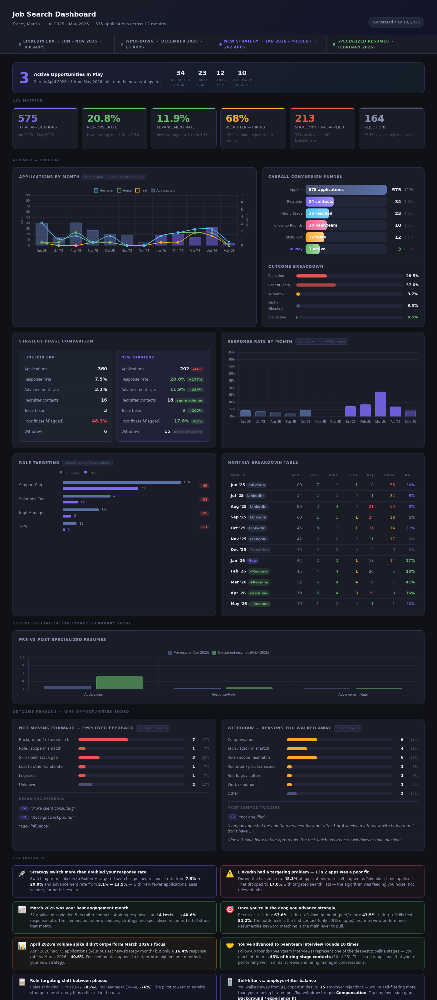
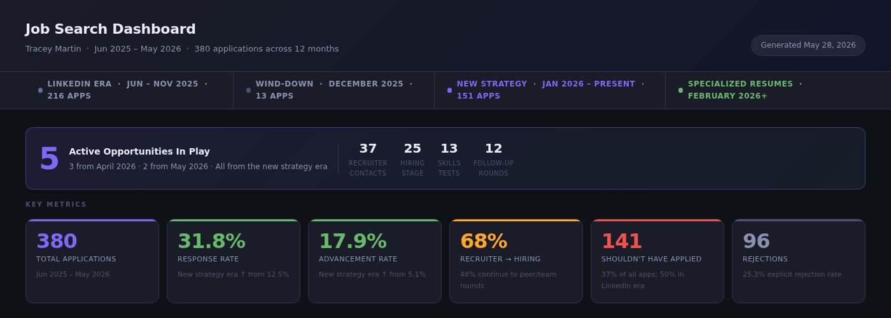
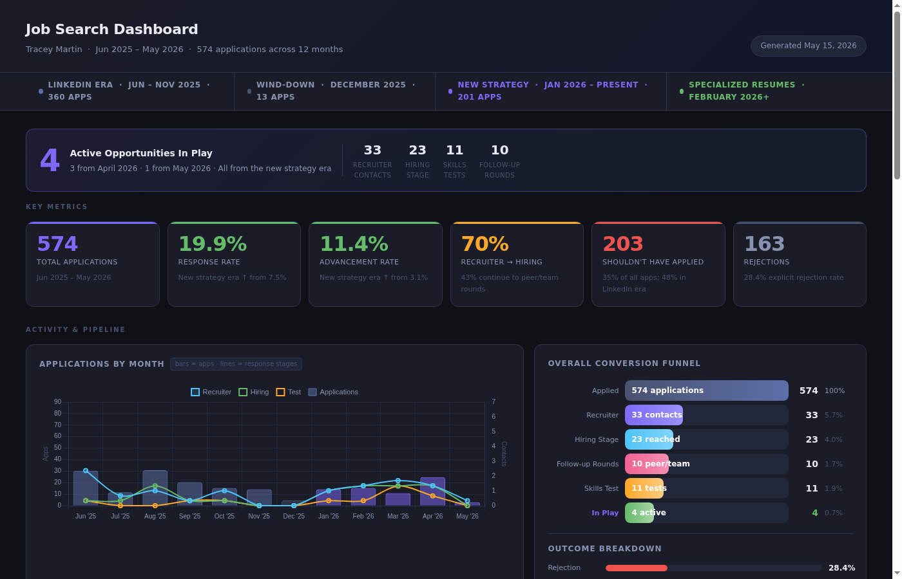

# Job Search Dashboard

A local dashboard that reads your job application spreadsheet (`.ods`) and generates a live, browser-viewable HTML report. Save the file — the dashboard updates automatically.



---

## What It Shows

- **Active opportunities in play** — highlighted at the top
- **Pipeline funnel** — Applied → Recruiter → Hiring → Follow-up Rounds → Skills Test → In Play
- **Phase comparison** — before vs. after switching job search strategies
- **Response & advancement rates** by month and phase
- **Role targeting shift** — how the roles you applied to changed over time
- **Resume specialization impact** — pre vs. post specialized resumes
- **Monthly breakdown table** — every month with color-coded signals
- **Outcome reasons** — categorized analysis of "Not Moving Forward" and "Withdraw" comments, with recurring themes and example feedback
- **9 insight cards** — auto-generated from your actual data

---

## Requirements

- Python 3.9+
- LibreOffice Calc (or any app that can edit `.ods` files)
- The following Python packages:

```bash
pip3 install pandas odfpy watchdog
```

---

## Quick Start

**1. Copy the example tracker**

```bash
cp example.ods MyJobs.ods
```

Open `MyJobs.ods` in LibreOffice Calc. It has the correct column headers and three sample rows to show the format.

**2. Generate the dashboard once**

```bash
python3 generate.py MyJobs.ods
```

This writes `dashboard.html`. Open it in any browser.

**3. Watch for changes (recommended)**

```bash
python3 watch.py MyJobs.ods
```

Leave this running while you update your spreadsheet. Every time you save, the dashboard regenerates. Just refresh the browser tab.

---

## Spreadsheet Format

| Column | Description |
|---|---|
| **Company** | Company name |
| **Applied** | Date in `MM-YYYY` format (e.g. `04-2026`) |
| **Title** | Job title / role you applied for |
| **In Play** | Mark `x` if still actively in the process |
| **Recruiter** | Mark `x` if a recruiter contacted you |
| **Hiring** | Mark `x` if you reached the hiring manager stage |
| **Test** | Mark `x` if you completed a skills/technical test |
| **Followups** | Mark `x` if you had follow-up interviews (peer/team rounds) |
| **Rejection** | Mark `x` if you received an explicit rejection |
| **Ghosted** | Mark `x` if they went silent with no response |
| **Should not have applied** | Mark `x` if you self-identify this as a poor-fit application |
| **Not Moving forward** | Mark `x` if told they're not moving forward (no formal rejection). Optionally replace `x` with a short comment describing why (e.g. `"More client consulting"`) — the dashboard will categorize and surface recurring themes. |
| **Withdraw** | Mark `x` if you withdrew your application. Optionally replace `x` with a short comment describing why (e.g. `"Salary too low"`) — the dashboard will categorize and surface recurring triggers. |

> Flag columns use `x` to mark — leave the cell empty otherwise. Multiple flags can be set on the same row (e.g. Recruiter + Rejection if you got a rejection after a recruiter screen).
>
> **Comment-aware columns:** `Not Moving forward` and `Withdraw` accept free-text comments in place of `x`. The dashboard groups them into themes (compensation, tech stack, background fit, etc.). To tune the categories or keywords, edit `NMF_CATEGORIES` and `WITHDRAW_CATEGORIES` near the top of `generate.py`.

---

## Configuring Your Search Phases

> ⚠️ **This section requires your review before using.**
>
> The dashboard is built around tracking a strategy shift mid-search. The original data tracked a move from LinkedIn job searching to using Builtin and targeted company lists (Top API companies, Unified API companies, Top Fintechs), combined with creating specialized resumes for different role types in February 2026.
>
> **You will need to update the phase constants at the top of `generate.py` to reflect your own search timeline and strategy.**

Open `generate.py` and find this block near the top:

```python
# ── Phase configuration (edit these to adjust search phases) ──────────────────
LI_START         = "06-2025"   # First month of your first search strategy
LI_END           = "11-2025"   # Last month of your first search strategy
TRANS_MONTH      = "12-2025"   # Transition / wind-down month (if any)
NS_START         = "01-2026"   # First month of your new strategy
RESUME_MONTH     = "02-2026"   # Month you updated or specialized your resume(s)
PRE_RESUME_MONTH = "01-2026"   # Last month before resume update (for pre/post comparison)
```

**What these control:**
- `LI_START` / `LI_END` — the date range labelled "Phase 1" (shown in the phase bar and all comparison stats). In the original data this was the LinkedIn era.
- `TRANS_MONTH` — an optional wind-down or gap month between strategies. Set it equal to `LI_END` if you don't have one.
- `NS_START` — when your new approach started. In the original data this was switching to Builtin + targeted search lists.
- `RESUME_MONTH` — when you updated or created specialized resumes. The dashboard shows a pre/post comparison from this point.
- `PRE_RESUME_MONTH` — the month just before `RESUME_MONTH`, used as the "before" period in the resume impact chart.

**Example: if your search started in January 2025 and you changed strategy in July 2025:**
```python
LI_START         = "01-2025"
LI_END           = "06-2025"
TRANS_MONTH      = "06-2025"   # same as LI_END if no gap
NS_START         = "07-2025"
RESUME_MONTH     = "09-2025"
PRE_RESUME_MONTH = "08-2025"
```

The phase labels in the dashboard ("LinkedIn Era", "New Strategy") are also configurable in `template.html` if you want to rename them to match your own context.

**Tip — let Claude Code do it for you.** Rather than editing the constants manually, open this project in Claude Code and describe your own search story. For example:

> *"I searched on Indeed from March 2025 through August 2025, then switched to LinkedIn Recruiter in September. I updated my resume in November. Update the phase constants and labels to reflect that."*

Claude Code will update `generate.py` and the phase labels in `template.html` to match your timeline — no manual file editing needed.

---

## Running

| Command | What it does |
|---|---|
| `python3 generate.py` | Auto-finds first `.ods` file (excluding `example.ods`) and generates `dashboard.html` |
| `python3 generate.py MyJobs.ods` | Generate from a specific file |
| `python3 watch.py` | Watch for changes, auto-regenerate |
| `python3 watch.py MyJobs.ods` | Watch a specific file |
| `python3 -m pytest test_generate.py -v` | Run the test suite |

---

## File Structure

```
job-search-dashboard/
├── generate.py       # Reads ODS → writes dashboard.html
├── watch.py          # File watcher — auto-regenerates on save
├── test_generate.py  # pytest test suite (68 tests)
├── template.html     # HTML/CSS/JS template (edit to customize look)
├── example.ods       # Blank tracker with correct headers + sample rows
├── screenshots/      # Dashboard screenshots (for this README)
└── README.md
```

Files intentionally excluded from this repo (see `.gitignore`):
- `Jobs.ods` — your private application data
- `dashboard.html` — generated output (contains your data)

---

## Screenshots

### Top of dashboard — in-play alert, KPIs, and pipeline



### Full dashboard view



---

## Notes

- The `Should not have applied` column is a self-audit flag — mark it when you realize in retrospect the role wasn't a good fit. The dashboard tracks this as a targeting quality signal across phases.
- `Followups` tracks **follow-up interview rounds** (peer interviews, team panels) — not follow-up emails. It's a mid-pipeline stage shown in the conversion funnel.
- The dashboard uses Chart.js loaded from a CDN — you need an internet connection the first time you open it. After that it may be cached by your browser.
- All data stays local. Nothing is sent anywhere.

---
